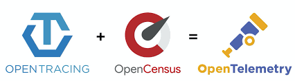
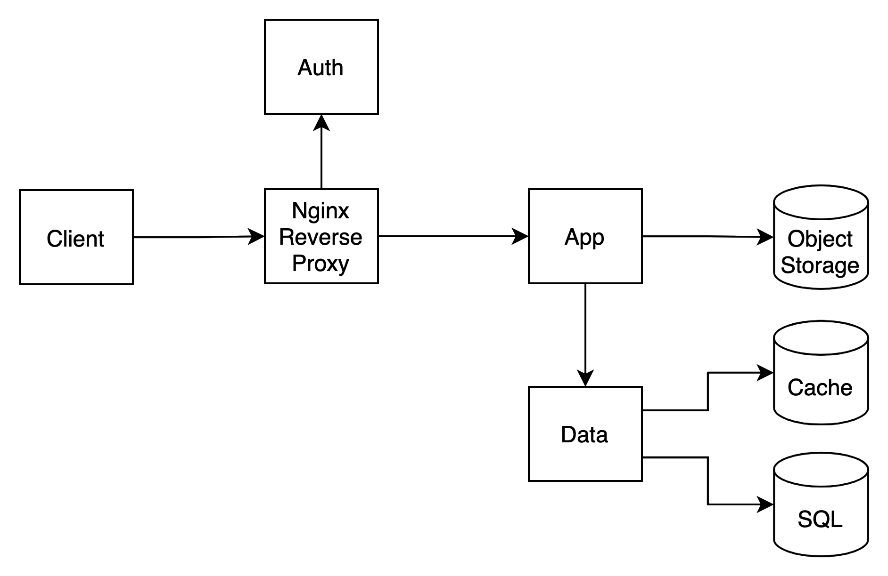
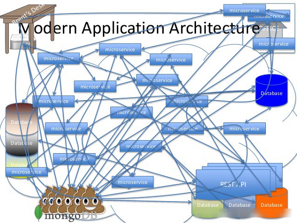
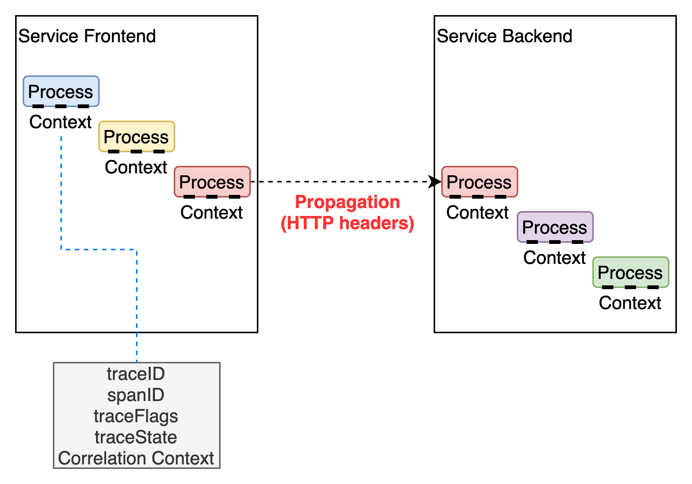
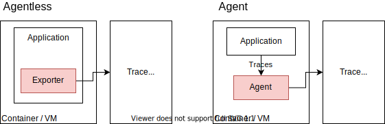
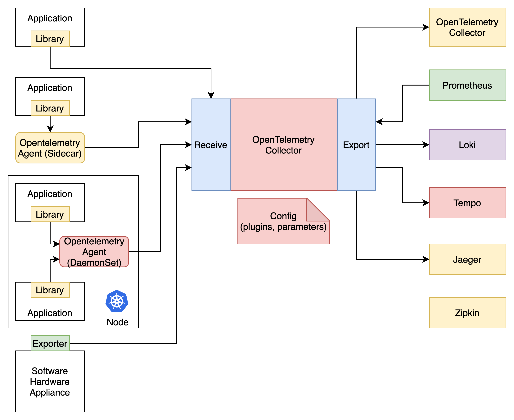

<!--
theme: gaia
style: |
    /*
    * @theme enable-all-auto-scaling
    * @auto-scaling true
    */
    /* @theme marpit-theme */
    section {
      font-size: 30px;
      padding: 50px;
    }
    section.lead h2 {
      font-size: 30px;
      text-align: center;
    }
size: 4K
headingDivider: 2 
paginate: false
-->

<!--
_class:
 - lead
 - invert
-->

# Getting Started with OpenTelemetry 

NexCloud 김진웅

## What is Observability?

#### Observability(관측가능성, 관찰가능성)
* 시스템의 속성을 자세히 설명하는데 사용하는 용어  
* System을 통해 시스템과 애플리케이션에서 발생하는 문제를 파악  
* 원격측정(Telemetry) Data : Logs, Metrics, Traces 

## Distributed Trace

시스템의 프로세스에서 특정 부분의 지연(latency)을 알려주는 원격 측정(telemetry)방법

마이크로 서비스 환경에서 지연 병목을 찾아내는 도구

## OpenCensus + OpenTracing = OpenTelemetry

 

이전 발표 : [OpenCensus with Prometheus and Kubernetes](https://www.slideshare.net/JinwoongKim8/opencensus-with-prometheus-and-kubernetes) 

* OpenCensus : 애플리케이션 메트릭과 분산 트레이스(traces)를 수집하기 위한 다양한 언어별 라이브러리 셋

* OpenTracing : 분산 추적(tracing)을 위한 벤더 중립적인 API와 계측(instrumentation)

## What is OpenTelemetry?

#### [OpenTelemetry](https://opentelemetry.io/) 

Observability에 필요한 telemetry 데이터(Logs, Metrics, Traces)를 계측(instrumentation)하고 내보내기(export)하는 SDK, Specification 등의 도구(Toos)

- Kubernetes 이후 가장 활발한 CNCF 프로젝트
- Open Standard, 커뮤니티 주도 Sandbox 프로젝트 by **CNCF**
- 라이브러리를 사용해서 벤더 중립적인(Agnostic) 방식으로 다양한 아키텍처의 애플리케이션 계측

## Ecosystem

- Support Language - Go, Ruby, C++, Rus, PHP, JavaScript, Java, etc...
- Ecosystem - Jaeger, Fluentbit, Prometheus, Kubernetes
- Communities
  - CSP: Azure, GCP, AWS
  - Vendors: Datadog, Dynatrace, honeycomb, Lightstep, New Relic, Splunk, Stackdriver
  - Users: Mailchimp, Shopify

## Why OpenTelemetry?

#### Simple Microservices

 

## Why OpenTelemetry?

#### Modern(Real) Architecture

 

## Context Propagation

#### 서비스간 트레이스 전달 규약

 

## Trace, Span
**Trace** in OpenTelemetry are defined implicitly by their Spans
**Span** represents an operation within a transaction.

## Trace Context Propagation
[W3C standard for Context Propagation](https://www.w3.org/TR/trace-context/)

### version-format   = trace-id "-" parent-id "-" trace-flags
trace-id         = 32HEXDIGLC  ; 16 bytes array identifier. All zeroes forbidden
parent-id        = 16HEXDIGLC  ; 8 bytes array identifier. All zeroes forbidden
trace-flags      = 2HEXDIGLC   ; 8 bit flags. Currently, only one bit is used.

Compatible with all **OpenCensus** Client Libraries.

## Glossary
- **Signal** : categories of telemetry (Metrics, logs, traces, and baggage)
- **Context** : context 제공 (W3C trace-context, B3, AWS X-Ray, etc)
- **Context Propagation**
- **Cross-cutting concern**

https://github.com/open-telemetry/opentelemetry-specification/blob/main/specification/glossary.md

## Terms
- **Traces** : get context
- **Spans** : "call" in a trace (Kind, Attributes, Events, Links)
- **Sampler** : always, probabilistic, etc.
- **Span Processor** : simple, batch, etc.
- **Expoter** : OTLP, Jaeger, Prometheus, etc.

## Client Architecture

## Collector Architecture

## Data Architecture

## Specification

| Traces | Metrics |
| --- | --- |
| **Context** : W3C trace-context, B3, etc | **Context** span and correlation |
| **Context** : W3C trace-context, B3, etc | **Context** span and correlation |
| **Context** : W3C trace-context, B3, etc | **Context** span and correlation |
| **Context** : W3C trace-context, B3, etc | **Context** span and correlation |
| **Context** : W3C trace-context, B3, etc | **Context** span and correlation |
| **Context** : W3C trace-context, B3, etc | **Context** span and correlation |
| **Context** : W3C trace-context, B3, etc | **Context** span and correlation |

https://github.com/open-telemetry/opentelemetry-specification/blob/main/specification/overview.md