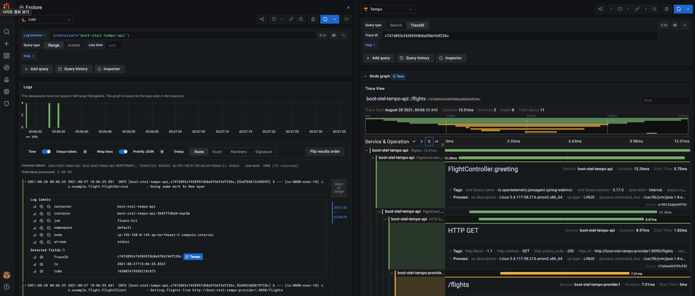

<!--
theme: gaia
style: |
    /*
    * @theme enable-all-auto-scaling
    * @auto-scaling true
    */
    /* @theme marpit-theme */
    section {
      font-size: 30px;
      padding: 50px;
    }
    section.lead h2 {
      font-size: 30px;
      text-align: center;
    }
size: 4K
headingDivider: 2 
paginate: false
-->

<!--
_class:
 - lead
 - invert
-->

# Getting Started with OpenTelemetry 

NexCloud 김진웅

## What is Observability?

#### Observability(관측가능성, 관찰가능성)
* 시스템의 속성을 자세히 설명하는데 사용하는 용어  

* 도구(tools)들을 통해 시스템과 애플리케이션에서 발생하는 문제를 파악하는 것  

* 원격측정(Telemetry) Data
  * Logs: 타임스탬프 메세지
  * Metrics : key-value 키-밸류 태그를 가지는 집계/통계 데이터 (주로 Gauge, Counter, Histogram 등)
  * Traces : 개별 Request가 전체 시스템에 전파(propagate)될 때 경로에 대한 기록  

## Distributed Trace (분산 추적)

* 시스템의 프로세스에서 특정 부분의 지연(latency)을 알려주는 원격 측정(telemetry)방법

* 요청(Requests)이 마이크로서비스 및 서버리스 아키텍처를 통해 전파될때 이동하는 경로를 기록

* 마이크로서비스 환경같은 최신 아키텍처에서 수많은 구성 요소간의 종속성과 관계를 측정하고 지연 병목을 찾아내는 도구이기 때문에 Observability에서 매우 중요

## OpenCensus + OpenTracing = OpenTelemetry

 

이전 발표 : [OpenCensus with Prometheus and Kubernetes](https://www.slideshare.net/JinwoongKim8/opencensus-with-prometheus-and-kubernetes) 

* OpenCensus : 애플리케이션 메트릭과 분산 트레이스(traces)를 수집하기 위한 다양한 언어별 라이브러리 셋

* OpenTracing : 분산 추적(tracing)을 위한 벤더 중립적인 API와 계측(instrumentation)

## What is OpenTelemetry?

#### [OpenTelemetry](https://opentelemetry.io/) 

Observability에 필요한 telemetry 데이터(Logs, Metrics, Traces)를 계측(instrumentation)하고 내보내기(export)하는 SDK, Specification 등의 도구(Tools)

- Kubernetes 이후 가장 활발한 CNCF 프로젝트
- Open Standard, 커뮤니티 주도 Sandbox 프로젝트 by **CNCF**
- 라이브러리를 사용해서 고해상도(high-quality),벤더 중립적인(Agnostic) 방식으로 다양한 아키텍처의 애플리케이션 계측

## Ecosystem

- 지원 언어 - **Go**, **JavaScript**, **Java**, **Python**, Ruby, C++, Rus, PHP, etc...
- 호환 : Jaeger, Fluentbit, Prometheus, Kubernetes
- 커뮤니티 주도
  - CSP : Azure, GCP, AWS
  - 모니터링 벤더 : Lightstep, Datadog, Dynatrace, honeycomb, New Relic, Splunk, Stackdriver
  - 사용자 : Mailchimp, Shopify

## Why OpenTelemetry?

#### Simple Microservices

 

## Why OpenTelemetry?

#### Real World is 

## Context Propagation

### Core Concept : 서비스간 트레이스 전달 규약 (W3C, Zipkin B3)

 

## Traces

- Trace : 서비스 요청에 대한 애플리케이션 또는 서비스 구조 확인하고, 모든 서비스들 간 데이터 흐름을 시각화하여 아키텍처상의 병목 현상을 파악 
- Span : 다양한 정보를 캡슐화(encapsulate)

<!-- 쉽게 설명하면 마이크로서비스에서 각각의 서비스를 span이라고 가정하면, span간 연결되는 점선을 trace의 context를 나타냅니다. 각 context에는 프로세스 내부의 function 또는 RPC를 통해 전달되는 여러가지 정보들이 담겨있습니다. 

span context 이외에도 뒤에서 설명할 trace와 span의 parent 식별자(id)와 prometheus와 유사하게 custom label로 process 및 request 관련 정보들을 담을수 있습니다. -->

## Spans
  * Name, Timestamp (start, finish) 
  * Attributes : 자유롭게 추가가능한 키-밸류 (Customer ID, Version, Host ID 등)
  * Events : 타임스탬프 문자열(String) 형태의 tuple (name, timestamp, attributes)
  * Links : Span의 인과 관계 
  * SpanContext : Span이 참조하는데 필요한 정보
    * TraceId : Worldwide 식별자 (16 bytes array identifier) 
    * SpanId(ParendId) : Globally in a service (8 bytes array identifier)
    * TraceFlags : Optional, Sampling bit (1 byte(8 bit), but only 1 bit used) 
    * Tracestate : Optional 키-밸류 (예, 벤더 식별 정보)

## W3C Trace Context
#### Trace Context :https://w3c.github.io/trace-context/
- 상관(Correlation) 정보 (요청에 대한 식별자 및 구성 요소 간의 parent-child 관계)에 대한 전달 방법에 대한 표준
  - traceparent : trace-id(TraceId), span-id(SpanId), sampling flag(TraceFlags)
  - tracestate
#### Baggage : https://w3c.github.io/baggage/
-  메트릭, 추적 및 로그에 사용자가 원하는 컨텍스트와 정보를 추가하는 데 사용
   -  baggage: userId=alice, baggage: serverNode=node01

## Passing Context

## Terms
- **Sampler** : always, probabilistic, etc.
- **Span Processor** : simple, batch, etc.
- **Exporter** : OTLP(OpenTelemetry protocol), Jaeger, Prometheus, etc.

- API: Used to generate telemetry data. Defined per data source as well as for other aspects including baggage and propagators.
- SDK: Implementation of the API with processing and exporting capabilities. Defined per data source as well as for other aspects including resources and configuration.
- Data: Defines semantic conventions to provide vendor-agnostic implementations as well as the OpenTelemetry protocol (OTLP).

## Client Architecture

#### Client Types

#### Client Data Pipeline

## Collector Architecture

## Collector Benefit

- 단일 Exporter 형태로 관리 가능
- Backend 선택 자유
  - Prometheus or Stackdriver
- 운영의 용이성
  - Application 내 API key, TLS 관리 일원화 
- 성능 (1 collector, 24 core, 48 GB)
  - 17.3 billion spans/day (초당 20만 spans)
  - 57 TB/day
  - no dropped spans

## Demo - Simple Java Application

## Demo - Observability Stack

##

##

##

##

## Sampling

#### Best Practices

출처 : https://opentelemetry.lightstep.com/best-practices/sampling/

<!-- span과 메트릭에 key=value를 추가하게 되는데 이는 데이터를 수집하는데 있어서 비용 문제를 발생시킴

그래서 샘플링이 필요하고 Sampling은 데이터를 수집, 분석하는 비용을 낮춰준다. 

하지만 biased sample, too-small sample 등 문제가 발생할 여지가 있기 때문에 이런 문제를 해결하기 위해서는 sampling rate 개념을 적용해서 특정 비율을 데이터를 수집하여 처리를 한다.

예전에 opencensus에는 Always, Never, Probabilistic, RateLimiting 이렇게 있었는데 
opentelemetry에는 확인이 필요함 -->

## Why you need OpenTelemetry and what it can do

- A single, vendor-agnostic instrumentation library per language with support for both automatic and manual instrumentation.
- A single collector binary that can be deployed in a variety of ways including as an agent or gateway.
- Send data to multiple destinations in parallel through configuration.
- Open-standard semantic conventions to ensure vendor-agnostic data collection
- The ability to support multiple context propagation formats in parallel to assist with migrating as standards evolve.
- With support for a variety of open-source and commercial protocols
- Easy to adopt OpenTelemetry.(If you have experienced OpenTracing and OpenCensus projects)

## What OpenTelemetry is not 

- OpenTelemetry is not an observability back-end like Jaeger or Prometheus. 
- Instead, it supports exporting data to a variety of open-source and commercial back-ends. 
- It provides a pluggable architecture so additional technology protocols and formats can be easily added.

## Specification

- API: Used to generate telemetry data. Defined per data source as well as for other aspects including baggage and propagators.
- SDK: Implementation of the API with processing and exporting capabilities. Defined per data source as well as for other aspects including resources and configuration.
- Data: Defines semantic conventions to provide vendor-agnostic implementations as well as the OpenTelemetry protocol (OTLP).
