<!--
theme: rose-pine-moon
style: |
    /*
    * @theme enable-all-auto-scaling
    * @auto-scaling true
    */
    /* @theme marpit-theme */
    section {
      font-size: 30px;
      padding: 50px;
    }
    section.lead h2 {
      font-size: 30px;
      text-align: center;
    }
    section.lead h2 {
      font-size: 30px;
      text-align: center;
      color: var(--pine);
    }
    img[alt~="center"] {
        display: block;
        margin: 0 auto;
    }
    h3, h4, h5, h6 {
        color: skyblue;
    }
headingDivider: 2 
paginate: false
-->


# OpenTelemetry Journey

2024.09
Jinwoong Kim

## Who am I?
- 김진웅 (Jinwoong Kim)

- Cloud Architect @AWS Professional Services

- Speaker, Translator

- @ddiiwoong

## Observability Introduction

### A *system* is `observable` if you can determine the *behavior* of the system based on its *outputs*.

<!--시스템의 출력을 기반으로 시스템의 동작을 파악할 수 있다면 시스템은 '관찰 가능'합니다.
system은 연결된 컴포넌트의 하나의 집합이라고 볼 수 있음
behavior는 시스템이 작동하는 방식
output은 behavior의 구체적인 결과
-->

## Observability

### Logs - 무슨 일이 일어난거야? (Lines of text)
```hikari-pool-1 - Connection is not available, request timed out after 30000ms```

### Metrics - 어떤 지표가 문제야? (Time-orderd set of data)
```hikaricp_connections_timeout_total{pool="HikariPool-1",} 10.0```

### Tracing - 그 일이 왜 일어났지? (Correlation analysis with Context)
```2022-05-28 18:09:04.165  INFO [service-b,757d0493f099b94b,4e8d66a6aa1c1ed6] 9989 --- [nio-8686-exec-3] c.example.msaerrorresponse.BServiceApi   : =======b-service======```

## Distributed Trace

* 시스템의 프로세스에서 특정 부분의 지연(latency)을 알려주는 원격 측정(telemetry)방법

* 요청(Requests)이 마이크로서비스 및 서버리스 아키텍처를 통해 전파될때 이동하는 경로를 기록

* 마이크로서비스 환경같은 최신 아키텍처에서 수많은 구성 요소간의 종속성과 관계를 측정하고 지연 병목을 찾아내는 도구이기 때문에 Observability에서 매우 중요

## Trace
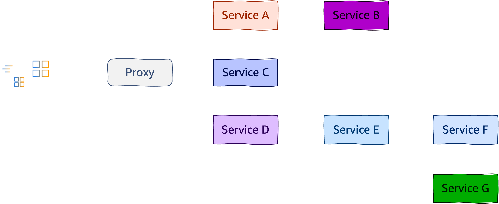


## Trace (Span)
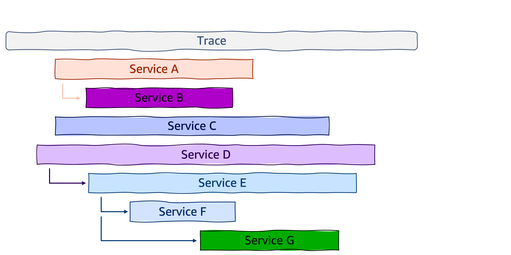

## Trace - context propagation
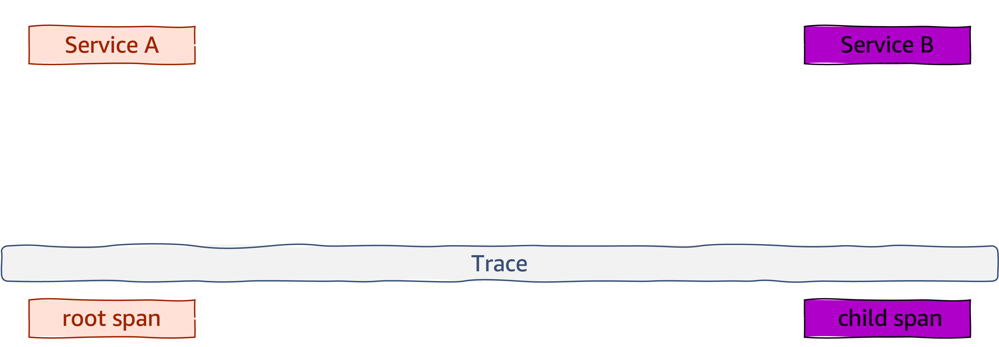

## Trace - context propagation
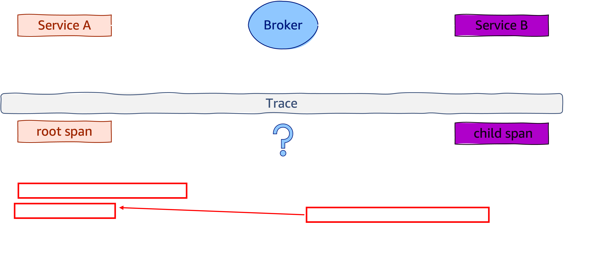

## Trace - context propagation
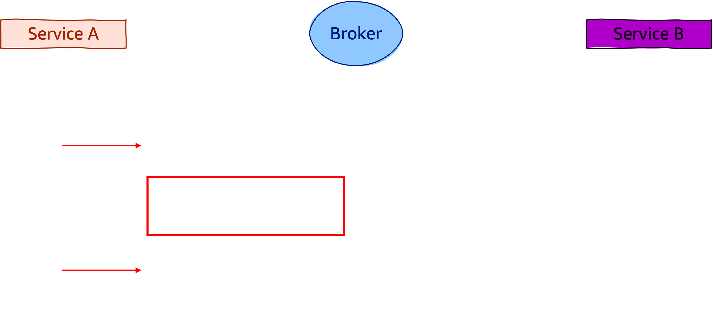

## Trace - context propagation
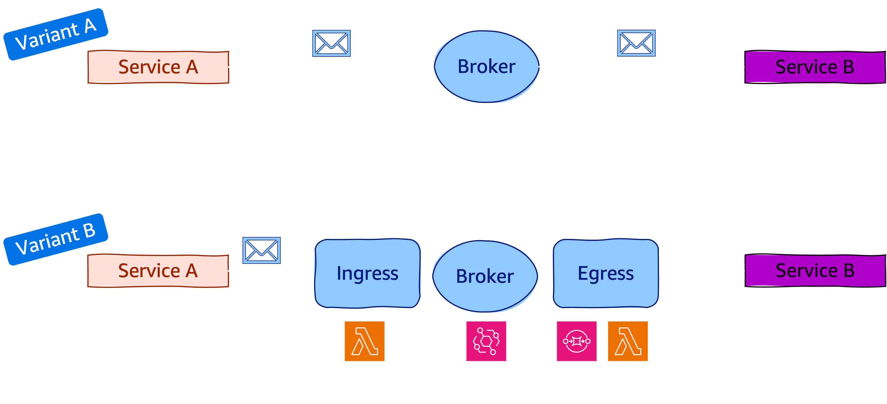

## Span

<!--
*`Trace`* give us the big picture, the ”full path” a request takes in your application

*`Span`* represents a unit of work or operations
-->

```json
{
  "name": "/v1/sys/health",
  "context": {
    "trace_id": "7bba9f33312b3dbb8b2c2c62bb7abe2d",
    "span_id": "086e83747d0e381e"
  },
  "parent_id": "",
  "start_time": "2021-10-22 16:04:01.209458162 +0000 UTC",
  "end_time": "2021-10-22 16:04:01.209514132 +0000 UTC",
  "status_code": "STATUS_CODE_OK",
  "status_message": "",
  "attributes": {
    "http.scheme": "http",
    "http.host": "10.177.2.152:26040",
  },
  "events": [
    {
      "name": "",
      "message": "OK",
      "timestamp": "2021-10-22 16:04:01.209512872 +0000 UTC"
    }
  ]
}
```

## Span

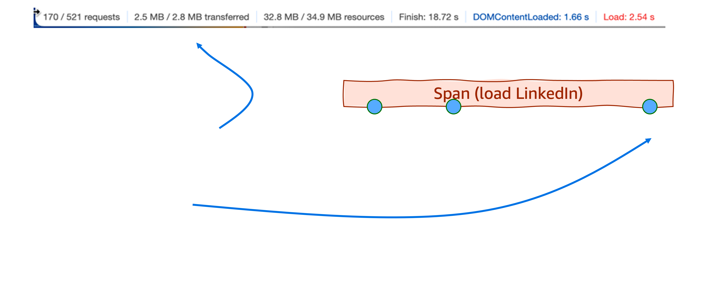

<!--
타임라인의 특정 지점에서 3개의 전용 이벤트가 있는 페이지 로드(LinkedIn)의 예를 볼 수 있습니다.

스팬 속성과 스팬 이벤트 사이에는 몇 가지 중요한 차이점이 있습니다:
스팬 속성은 스팬을 쿼리하고 필터링하는 데 사용할 수 있습니다. 예를 들어 응답_크기 > 2MB인 모든 스팬을 표시합니다. 스팬 이벤트는 같은 방식으로 사용할 수 없습니다. 예를 들어 다음과 같은 쿼리는 불가능합니다. “SQS 대기열로 보낸 메시지”라는 이름의 이벤트가 있는 모든 스팬을 표시해 주세요.
스팬 속성은 시간 범위에 적용되는 반면, 스팬 이벤트는 특정 시점을 참조합니다.
범위 속성은 대부분의 최신 통합 가시성 백엔드에서 무료로 제공되는 반면, 범위 이벤트는 개별 단위로 계산됩니다. 즉, 6개의 스팬 속성을 가진 '넓은 이벤트'는 6개의 스팬 이벤트를 가진 단일 스팬보다 7배 더 저렴합니다.

이러한 속성 때문에 스팬 속성은 자유롭게 사용하고 스팬 이벤트는 아껴서 사용하는 것이 좋습니다. 하지만 두 가지 뉘앙스가 있습니다:
항상 예외를 스팬 이벤트로 방출하세요. 이것은 표준 OpenTelemetry 관행이며, 모든 OpenTelemetry SDK에서 기본적으로 지원됩니다. 예외 이벤트의 형식은 표준화되어 있으며, 인시던트가 발생할 때 이 데이터를 사용할 수 있으면 엄청난 이점을 얻을 수 있습니다.
많은 스팬 이벤트로 애플리케이션을 계측하되, 개발 목적으로만 사용하는 것을 고려하세요. 이는 프로덕션 환경에서 스팬 이벤트를 비활성화하거나 제거(예외 제외)하면 가능합니다.
-->

## Hello, OpenTelemetry

Open source project hosted on CNCF
Specifications, Implementations for instrumentation and transmissions of telemetry data (metrics, logs, traces)

1. Cross-language specifications

2. OpenTelemetry Collector (agent)

3. SDKs for each language

4. Auto Instrumentation

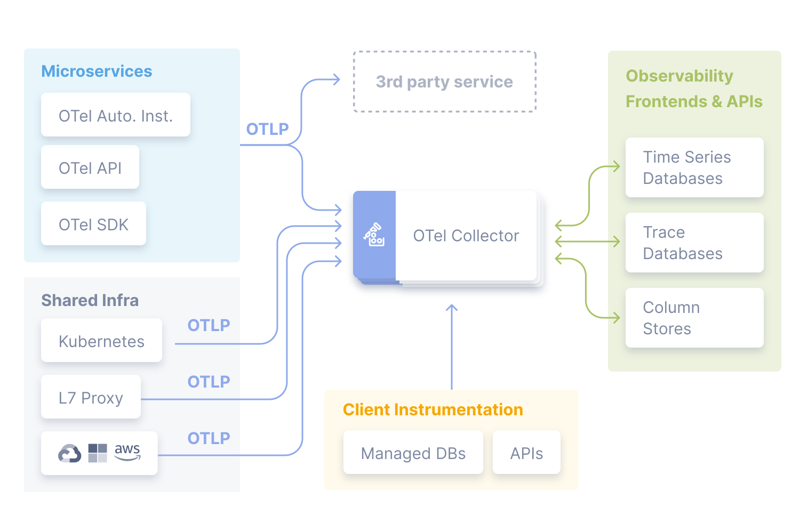

<!--  통합 observability 백엔드로 원격 분석을 수집, 변환 및 전송하기 위한 표준화된 공급업체 독립적인 SDK, API 및 도구 세트입니다. 
- 트레이스 도구가 아니고
- 백엔드 스토리지 시스템도 아니고
- 시각화를 제공하는 도구도 아니다.
-->

## OpenTelemetry Instrumentation

1. Code-based solutions via [official APIs and SDKs](https://opentelemetry.io/docs/languages/) for most languages
    - `API` defines data types and how to generate telemetry data.
    - `SDK` defines a language-specific implementation of the API, plus configuration, data processing and exporting.
    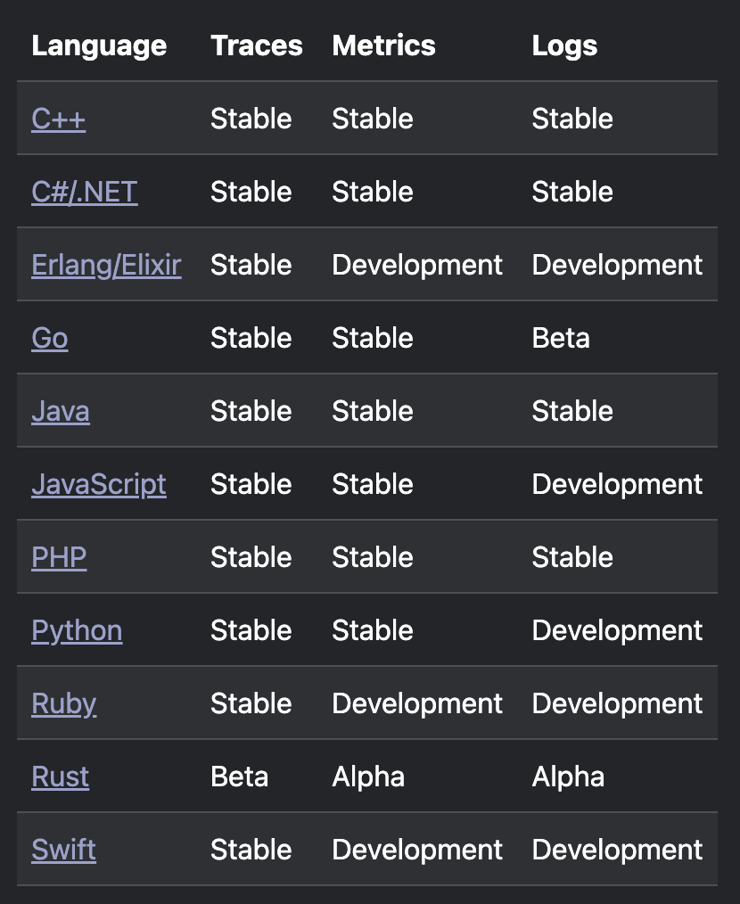

2. [Zero-code solutions](https://opentelemetry.io/docs/zero-code/)
    - [Go](https://opentelemetry.io/docs/zero-code/go/), [.NET](https://opentelemetry.io/docs/zero-code/net/), [PHP](https://opentelemetry.io/docs/zero-code/php/), [Python](https://opentelemetry.io/docs/zero-code/python/), [Java](https://opentelemetry.io/docs/zero-code/java/), [JavaScript](https://opentelemetry.io/docs/zero-code/js/)

## Manually Instrumentation (Python)

```python
@app.route("/server_request")
def server_request():
    with tracer.start_as_current_span(
        "server_request",
        context=extract(request.headers),
        kind=trace.SpanKind.SERVER,
        attributes=collect_request_attributes(request.environ),
    ):
        print(request.args.get("param"))
        return "served"
```

## Programmatically-instrumented server (Python)
```python
instrumentor = FlaskInstrumentor()

app = Flask(__name__)

instrumentor.instrument_app(app)
# instrumentor.instrument_app(app, excluded_urls="/server_request")
@app.route("/server_request")
def server_request():
    print(request.args.get("param"))
    return "served"

```

## OpenTelemetry Registry

OpenTelemetry instrumentation libraries

https://opentelemetry.io/ecosystem/registry/

### Search `NGINX`

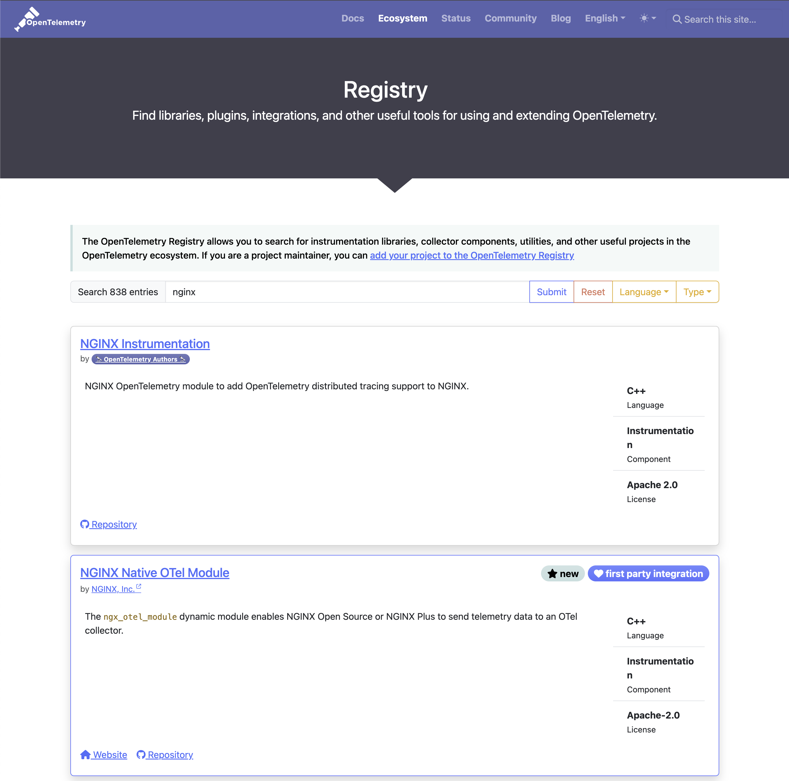

## OpenTelemetry collector


<!-- The Collector is a proxy that receives, processes and exports telemetry data in OTLP, Prometheus, and many proprietary tools. -->


## OpenTelemetry protocol (OTLP)

https://github.com/open-telemetry/opentelemetry-proto/blob/main/docs/specification.md

<!-- OTLP(오픈 텔레메트리 프로토콜) 사양은 텔레메트리 소스, 수집기, 텔레메트리 백엔드 등의 중간 노드 간의 텔레메트리 데이터 인코딩, 전송 및 전달 메커니즘을 설명합니다. -->

##### OTLP is implemented over `gRPC` and `HTTP` transports and specifies the Protocol Buffers schema used for payloads.

##### OTLP is a request/response style protocol where `clients` send requests and the `server` replies with corresponding responses.

##### All server components must support the following transport compression options: `none`, `gzip`


## Resource Semantic Conventions

##### A `Resource` represents the entity producing telemetry as resource attributes.
https://opentelemetry.io/docs/specs/semconv/

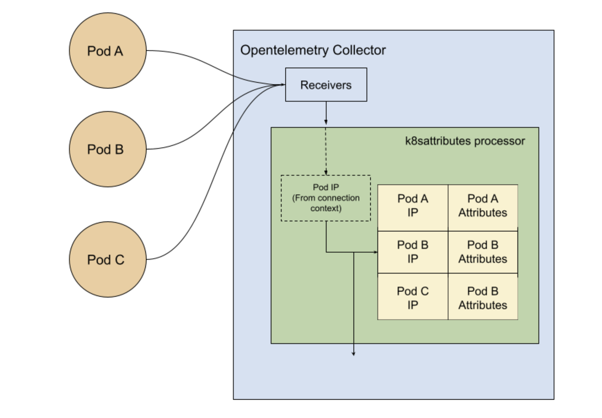
<!-- 리소스는 원격 분석을 생성하는 엔티티를 리소스 속성으로 나타냅니다. ㅇ
예시는 Kubernetes 객체와 메타데이터를 이해하는 데 유용한 리소스입니다: -->

## AWS Distro for OpenTelemetry (ADOT)

- Secure, production ready, and supported by AWS OpenTelemetry distribution	

-  Extend functionality for ease of use on AWS

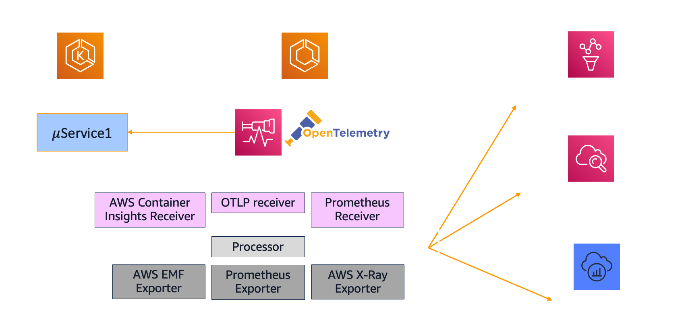

<!-- ADOT 수집기
사용자 환경에서 통합 가시성을 위해 ADOT를 사용하는 경우, 텔레메트리 데이터 수집은 ADOT 수집기를 사용하여 수행됩니다. ADOT 수집기는 텔레메트리 데이터를 수신, 처리 및 내보내는 방법에 대해 공급업체에 구애받지 않는 구현을 제공합니다. 따라서 하나 이상의 오픈 소스 또는 상용 백엔드로의 전송을 지원하기 위해 여러 개의 에이전트를 실행하고 유지 관리할 필요가 없습니다.
또한 수집기는 OpenTelemetry 계측 라이브러리 중 하나를 사용하는 경우 텔레메트리 데이터의 기본 위치이기도 합니다. -->

## AWS Distro for OpenTelemetry (ADOT)

<!-- ADOT를 사용하면 애플리케이션을 한 번 계측하고 연관된 로그, 메트릭, 추적을 Prometheus용 Amazon Managed Service, Amazon CloudWatch, AWS X-Ray, Amazon Open Search, 모든 OTLP(OpenTelemetry Protocol) 호환 백엔드, Apache Kafka용 Amazon Managed Streaming(MSK)과 같은 하나 이상의 가시성 백엔드로 전송할 수 있습니다: -->
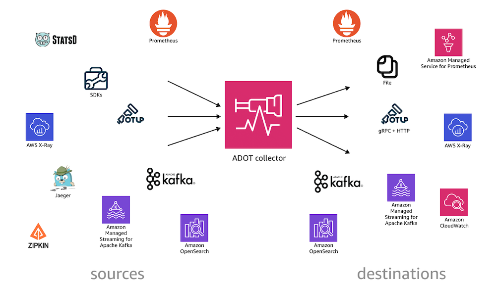

## OpenTelemetry Demo

[OpenTelemetry Demo](https://github.com/open-telemetry/opentelemetry-demo) is composed of microservices written in different programming languages that talk to each other over gRPC and HTTP; and a load generator which uses Locust to fake user traffic.

- [Web store](http://localhost:8080/)
- [Grafana](http://localhost:8080/grafana/)
- [Load Generator](http://localhost:8080/loadgen/)
- [Jaeger UI](http://localhost:8080/jaeger/ui/)


## New Otel Feature
Envoy and Istio
Profiling Agent
LLM Observability

## OpenTelemetry Collector Antipatterns


## References

- https://opentelemetry.io/docs/
- https://w3c.github.io/trace-context/
- https://w3c.github.io/baggage/
- https://github.com/open-telemetry/opentelemetry-specification
- https://opentelemetry.io/docs/specs/semconv/
- https://opentelemetry.io/docs/specs/otel/protocol/
- https://opentelemetry.io/docs/concepts/sampling/
- https://opentelemetry.io/docs/demo/
- https://opentelemetry.io/blog/2024/

# Thank You